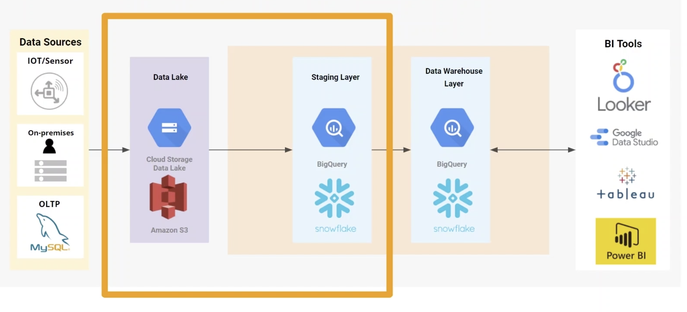

# Data Warehousing (DW)

## OLTP/OLAP

|  | OLTP | OLAP |
|:---|:---|:---|
| Purpose | Transaction; control and run essential operations in real-time | Analytics; reporting, discover insights, support decisions |
| Data updates | Short, fast updates, ACID | Refreshes periodically, scheduled batch processing |
| DB design | Normalized DB for efficiency | Denormalized DB for downstream analysis (dimensional model) |
| Space requirements | Generally small if historical data is archived | Generally large due to aggregating large data |

## Characteristic of DW

- subject-oriented
  - focus on a subject
  - not on operational day to day
- integrated
  - data from different sources
  - data is uniformly transformed
  - well-defined schema
- time-variant
  - data is organized in time periods
  - contains element of time eitther implicitly or explicitly
- non-volatile
  - only loading and accessing data is allowed
  - daat is refreshed att scheduled time

## DW Architecture

- single-tier
  
  

  - all of source data is stored directly inside data warehouse layer
  - pro: save data storage and reduce redundancies
  - con: query data directly from dw that make BI tools slow down returning results
- two-tier
  
  

  - separate between sources and dw
  - add data lake and staging layer before dw layer
    - prevent dw being the main area of stored raw data
    - data lake: single storage area for all source data
    - staging layer: can do any transformation/cleaning before storing data in dw

- three-tier
  
  

  - add data mart layer
    - enable BI insight through data mart layer
    - model data to serve specific business purpose
  - three-tier
    - bottom tier: data source, data lake, staging
    - middle tier: data warehouse layer, data mart layer
    - top tier: BI tools/dashboards

## Data Lake

- single store of raw data, cost-effective storage
- data can be structured, unstructed, images, log, etc.
- data is in raw format
- give us better data governance

## 5V in Big Data

- volume: large amount of data
- velocity: speed of data processing
- variety: different types of data
- veracity: the level of trust in the data
- value: the value within the data

## DL vs DW

|  | DL | DW |
|:---|:---|:---|
| Data Structure | Structured, unstructured, raw from all the available sources | Structured, processed data after applying transformation/clean up |
| Users | DE, DS | BI developer, Analyst |
| Schema-position | Schema-on-read | Schema-on-write |
| Purpose | Location to store all raw data | Defined purpose for BI, reporting |
| Storage | Low cost storage for large amount of data | Can be expensive to store large amounts of data |

## Staging Layer

- between data lake and dw
- mutliple data source aggregated at staging layer
- perform data cleaning, transformation, validations
- storing data in this layer makes processing easier

## DW Layer

- transformed data from staging layer
- data modelling (dimensional model, OBT, Data Vault)
- data masking, PII data
- optimization strategies
- metadata info is also stored for data lineage

## Data Mart

- subset of DW
- data is organized in small managable chunks
- source data for BI

## ETL

- Extract
  - extract data from the source
  - data goes into a temporary or persistent storage area
  - batch or streaming data
  - data validation checks (format, null values, new columns etc.)
- Transform: improve quality
  - cleansing: solve and clean any inconsistency
  - standardization: apply formatting rules
  - deduplication: remove duplicates and redundancies
  - verfication: flag anomalies and remove unusable data
  - sorting: organize by type
  - other tasks: other rules applied to improve data quality
- Load
  - load the transformed data into dw
  - conduct data quality check during load
  - recovery mechanism to handle load failure
  - types
    - full refresh load: load all data as fresh
    - incremental load: scheduled at intervals

## ETL vs ELT

|  | ETL | ELT |
|:---|:---|:---|
| volume | small/medium data volume | large data volume |
| load time | slow as transformation before loading to DW | fast loading as transformation happens later |
| data type | structured data | structured & unstructured data |
| complexity | compute-intensive & complex | less complex due to transformation within SQL |
| cost | high | low |
| availability | only required for reporting/analysis | everything can be accessed from DL |
| maintenance | high-maintenance due to on-premise solutions | low-maintenance due to cloud solution |
| data governance & security | removes PII before load | option to remove PII before load but require more work; PII is removed after load |

## Reference

1. [Analytics-engineering-bootcamp](https://www.udemy.com/course/analytics-engineering-bootcamp/)
2. [DE-zoomcamp](https://www.youtube.com/watch?v=jrHljAoD6nM&list=PL3MmuxUbc_hJed7dXYoJw8DoCuVHhGEQb&index=26&ab_channel=DataTalksClub)